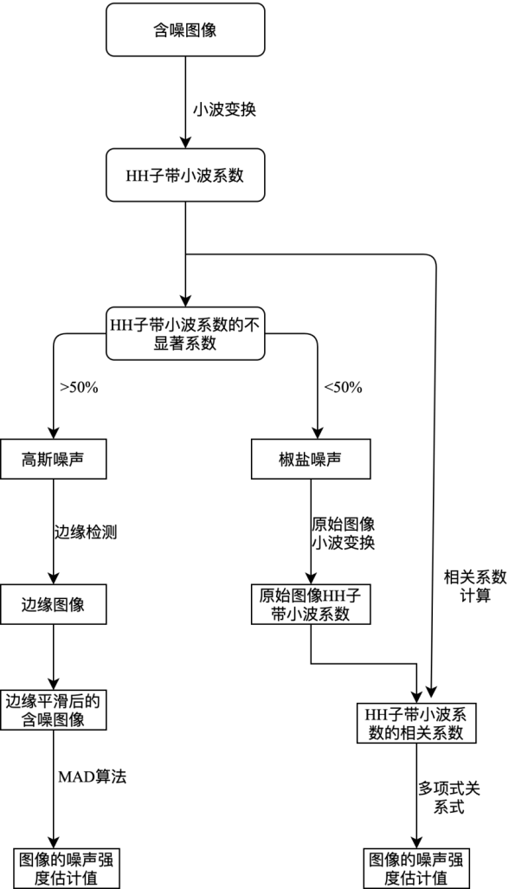

# 摘要
##  程序原理
不同类型的噪声图像的HH子带小波系数的能量占比ER的变化趋势和范围完全不同。高斯白噪声的ER曲线变化幅度大，在T=70时就已经达到最大值——100%，而椒盐噪声的ER曲线变化幅度小，在T=90时也才不到50%。因此可以将T=60作为区分HH系数是否显著的阈值，同时将HH子带小波系数ER=50%作为区分图像噪声的不同类型的分界线：该图像的HH子带小波系数ER>50%时判断该图像受高斯白噪声污染；ER<50%时图像则受到椒盐噪声的污染。
## 程序步骤
该图像噪声估计模型分为以下几个步骤：

1. 基于小波变换对被测图像进行处理并得到该图像的小波系数。
2. 计算该图像HH子带小波系数的分布情况，得到HH子带小波系数的占比度。
3. 根据HH子带小波系数的集聚度识别出图像的噪声类型。
4. 根据图像的噪声类型不同从而选择不同的噪声估计算法去估计其噪声的强度。
5. 对于受高斯白噪声污染的噪声图像，使用结合了图像边缘识别算法和边缘平滑处理的MAD算法对图像噪声进行估计。
6. 对于受椒盐噪声污染的噪声图像，在小波域中根据原始图像和噪声图像的小波系数的相关系数利用多项式拟合模型对图像噪声进行估计。

## 程序依赖
* matplotlib
* numpy
* scipy
* opencv-python
* prettytable

## 程序用法
* edge-detection: 该文件夹包含Canny算子、Prewitt算子、Roberts算子、Sober算子以及经过我改进后的Laplacian算子，用church图像为例得出它们的边缘检测图
* noise-estimation: 该文件夹包含主程序，其中HH coefficient为检测图像噪声的自适应算法。T-parameter用于确定椒盐噪声和高斯噪声ER分界线的阈值；pepper-salt noise estimation用于拟合椒盐噪声的HH子带偏离程度与噪声强度之间的函数关系式。
* test：[Corel5K图像集](https://github.com/watersink/Corel5K)中随机选取的100副原始图像用于测试程序。

使用该程序时运行HH coefficient.py即可得到测试集的测试结果
